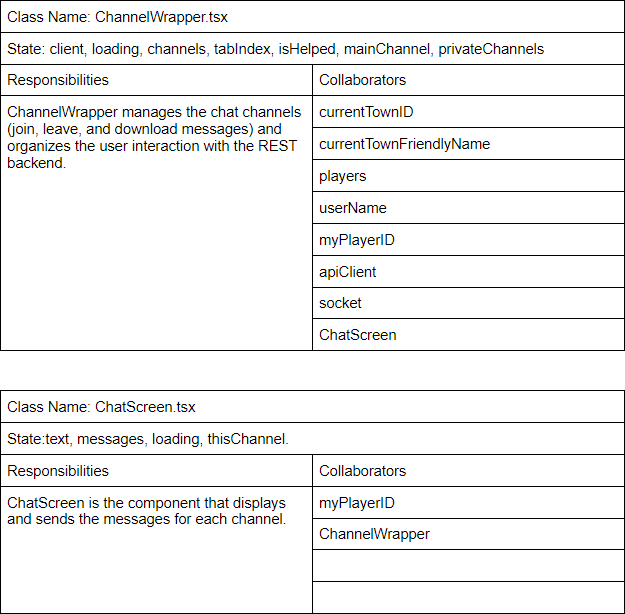

# Design

## Architecture

In planning to design for a chat feature, we had considered several options: 
1) Using websockets similar to how the player movements was implemented
2) Using a REST service to send messages between the backend and frontend.  
3) Using Twilio Chat API

Since we're already using the Twilio Video, and the Twilio Chat is already integrated mostly integrated, we believe that this would have made it easier to implement since it would be similar to integrating Twilio Video.

## Overview
The Twilio Programmable Chat service has a REST API and an SDK. As best practices mentioned by the [Twilio Docs](https://www.twilio.com/docs/chat/fundamentals), the backend service should authenticate a user token to send to the frontend client to connect to the service. The Twilio REST API is used to create, delete, update rooms, as well as inviting players into a private channel. By putting this logic to the backend, we can apply our business logic and increase security to prevent the frontend client to perform malicious/unauthorized on the chat such as delete the main chat channel.

The Twilio Javascript SDK uses the token generated by the backend to authenticate to our instance of Twilio Chat. On the frontend, upon connecting to Twilio, we attach callback functions to the Twilio Websocket to certain events such as channelInvited or channelLeft. This allows us to customize the frontend experience for these events.

To describe the specific changes, we decided to use a UML diagram to show the Object-Oriented Design approach to our backend. For the frontend, we used CRC to show the states that they have when rendering.

## UML of the Backend Changes

We created the Interface IChatClient to enable the backend to swap chat providers. The only required method is getToken for the backend to authorize a session token to the frontend client to connect. The TwilioChat class implements the IChatClient interface which has the specific methods to manage the Twilio chat service. The CoveyTownController now has a TwilioChat client to perform methods when certain Covey Town requests occur. For example, if a create town request occurred, the CoveyTownController would use the TwilioChat client to also create a public channel for that town.

## Specific changes to the backend
On the backend, we modified `CoveyTownController.ts`, the request handler `CoveyTownRequestHandlers.ts` and the router `towns.ts`, and added `TwilioChat.ts`.

### `CoveyTownController.ts`
The major additions we made were to assign a public room channel to the town, a list of private channels between two players, a list of channels that a player has with the help bot. Some changes we made were to generate a chat token as soon as a player is connecting to the town. This also allows us to clean up the private channels and help channels when a room is deleted.

### `CoveyTownRequestHandlers.ts` and `towns.ts`
The major changes to the `CoveyTownRequestHandlers.ts` was to integrate the chat to a town more seamlessly. When a town is created, we simultaneously create a new public town channel for players to communicate in. Similarly, when the town's friendly name is updated or if the channel is deleted, we also delete the channel. Towns, we added the additional routes `/chat` and `/help` to support the creation of the new chat chnanels, one between users and another between a user and a bot. 

Other handlers we added were to create a private channel for private messaging between two players and creating a channel with a player and a help bot.

### `TwilioChat.ts`
`TwilioChat.ts` is the Twilio REST API client. This allows us to generate tokens to send to the frontend client using an identity. An identity is usually a username. However, since covey town does not have a way of authenticating and persisting user data, we decided to create the identity with a combination of playerId and username to guarantee uniqueness. By doing so, we're able to provide security in that other player's that logs in with the same username are unable to read the previous private chats of that user since each playerId is unique when joining a covey town. 

The TwilioChat Rest client allows the backend to  create new channels, invite players to a channel, add bots to a channel.  

## CRC Cards of the Frontend Changes

## Specific changes to the frontend
We added two new functional components to the front end: `ChannelWrapper.tsx`, and `ChatScreen.tsx`.
On the frontend, the chat component is rendered in `App.tsx` and is made up of `ChannelWrapper.tsx` which is made up of `ChatScreen.tsx` components. 

## `ChannelWrapper.tsx`
`ChannelWrapper.tsx` manages the chat channels and organizes the user interaction with our REST backend. The `ChannelWrapper` takes in a token, which is generated along with the Twilio Video token. On mounting the ChannelWrapper, we use the Twilio Javascript SDK client to connect to the Twilio Chat service using that token. The ChannelWrapper uses `TownsServiceClient` to communicate with our backend to create a private message with another player and to create help bot. It also allows downloading a text file of a log of the main channel's messages, and switching between channels using tabs at the top. This component wraps around multiple `ChatScreen.tsx` components in TabPanels, each of which is passed a channel.

## `ChatScreen.tsx`
`ChatScreen.tsx` is the component that displays the chats for each channel. As mentioned, the ChatScreen takes in a channel which represents the current channel that the user is viewing. Each `ChatScreen.tsx` component manages its own individual chat channel's messages, including displaying and sending messages. When a player initiates a new private chat in `ChannelWrapper.tsx`, a new `ChatScreen.tsx` is rendered in a TabPanel for that chat's channel. 

