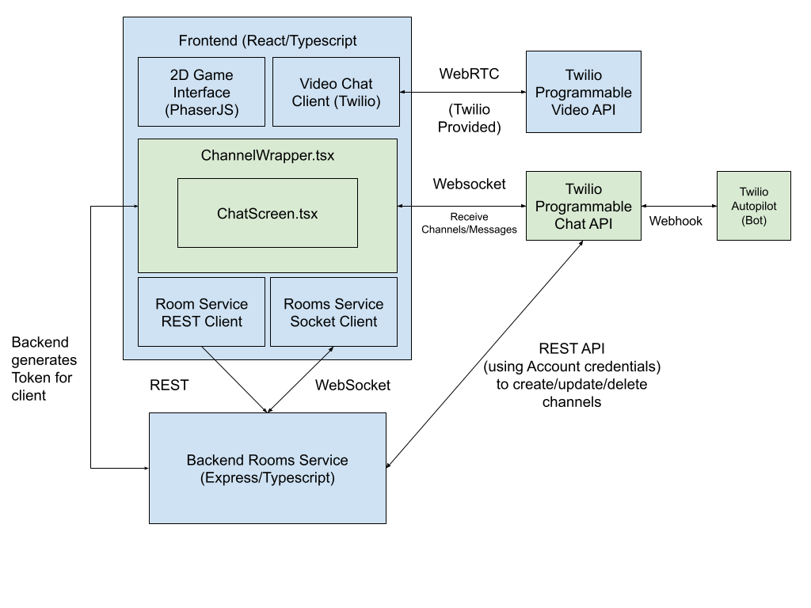

# Design

In planning to design for a chat feature, we had considered several options: 
1) Using websockets similar to how the player movements was implemented
2) Using a REST service to send messages between the backend and frontend.  
3) Using Twilio Chat API

We decided to use the Twilio Chat API.

## Overview
The Twilio Programmable Chat service has a REST API and an SDK. As best practices mentioned by the Twilio Docs, the backend service should authenticate a user token to send to the frontend client to connect to the service. The Twilio REST API is used to create, delete, update rooms, as well inviting players into a private channel. By putting this logic to the backend, we can apply our business logic and increase security to prevent the frontend client to send malicious/unauthorized usage of the chat.

## Specific changes to the backend
On the backend, we modified `CoveyTownController.ts`, the request handler `CoveyTownRequestHandlers.ts` and the router `towns.ts`, and added `TwilioChat.ts`.

### `CoveyTownController.ts`
The major additions we made were to assign a public room channel to the town, a list of private channels between two players, a list of channels that a player has with the help bot. Some changes we made were to generate a chat token as soon as a player is connecting to the town. This also allows us to clean up the private channels and help channels when a room is deleted.

### `CoveyTownRequestHandlers.ts` and `towns.ts`
The major changes to the `CoveyTownRequestHandlers.ts` was to integrate the chat to a town more seamlessly. When a town is created, we simultaneously create a new public town channel for players to communicate in. Similiarly, when the town's friendly name is updated or if the channel is deleted, we also delete the channel.

Other handlers we added were to create a private channel for private messaging between two players and creating a channel with a player and a help bot.

### `TwilioChat.ts`
`TwilioChat.ts` is the Twilio REST API client. This allows us to generate tokens to send to the frontend client using an identity. An identity is usually a username. However, since covey town does not have a way of authenticating and persisting user data, we decided to create the identity with a combination of playerId and username to guarantee uniqueness. By doing so, we're able to provide security in that other player's that logs in with the same username are unable to read the previous private chats of that user since each playerId is unique when joining a covey town. 

The TwilioChat Rest client allows the backend to  create new channels, invite players to a channel, add bots to a channel.  

## Specific changes to the backend

