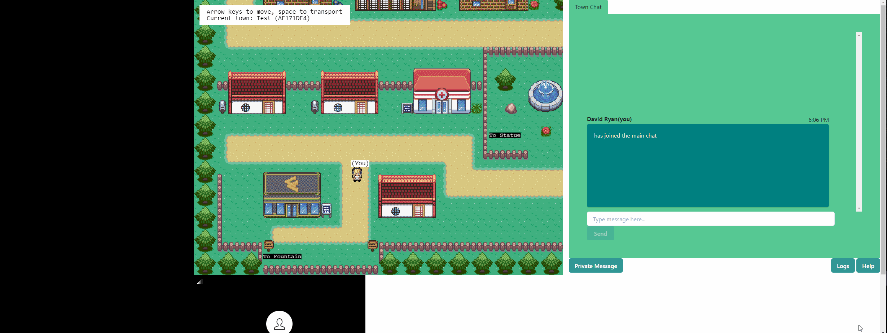
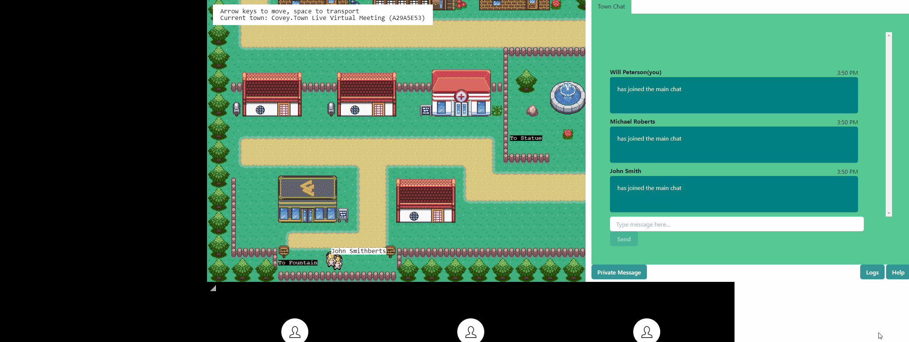
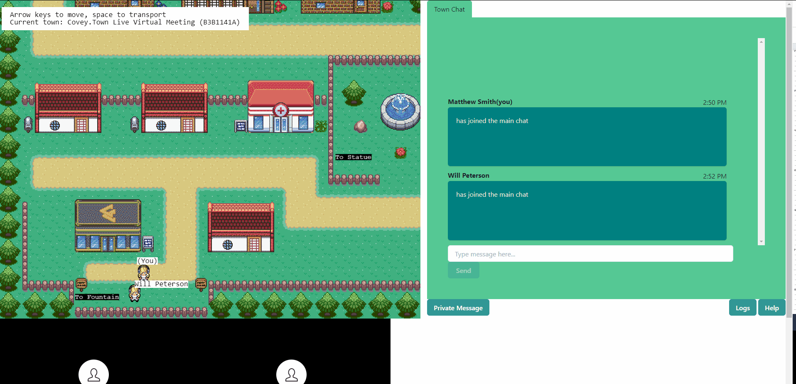

# Features

General usage outside of a user story, but necessary to fully interact with our implementation of Covey.Town.
Due to the use of keyboard input commands the user must click outside of the input box in the green area of the chat screen in order to continue interacting with the map once they are done typing into the chatbox and vice versa.

We assume that users understand clicking an "X" will close a chat tab and that clicking a chat tab that is unopened, but on display will switch to that chat tab.

## User Stories

### User Story 1:

(Must-have) As a meeting participant, I want to be able to communicate with other participants without a microphone so that I don’t have to be verbal.

#### Conditions of satisfaction:

- some text-based method of communication to the users near me
- the ability to be able to type and send messages to the rest of the meeting participants

#### Feature Interaction:

The application has an automatically created Town Chat which is the main chat room for the town. A user simply has to type into the chatbox and click send (or press the enter button) to send the message to the general chat. The chat room is visible to all users who are logged into the town.

Sending Messages in the Town Chat:

Receiving Messages in the Town Chat:

### User Story 2:

(Must-have) As a person with a disability, I want to be able to have a written communication method so that I can more easily participate.

#### Conditions of satisfaction:

The ability to have a log of the public chat to refer to at a later time (does not include private chat for privacy purposes)

#### Feature Interaction:

In the menu bar beneath the chat screen, there is a button Logs. By clicking the logs button a user will download a .txt. File with the current public chat logs formatted to show when they were sent, who sent them and what was sent.

### User Story 3:

(Optional) As a forgetful user, I want to easily access a how-to guide or tutorial so that I can effectively use the application.

#### Conditions of satisfaction:

easy commands to a chatbot to access help features, and other tools in a private message
a command legend somewhere easily visible

#### Feature Interaction:

In the menu bar beneath the main chat screen, there is a Help button. Pressing the button creates a new private chat with the automated chatbot. The chatbot greets the user and the user is able to ask questions and get answers based on what the chatbot has been trained to answer. Our chatbot supports, Insert features here.

### User Story 4:

(Must-have) As a meeting participant, I want to be able to ask someone a question without interrupting the whole meeting.

#### Conditions of satisfaction:

can privately direct message another participant (not visible to the rest of the chat).
can visibly distinguish between the private message chat from main chat.

#### Feature Interaction:

In the menu bar beneath the main chat, there is a menu “Select User To Private Message”. This menu will display all users who are considered nearby. Clicking a Username from that list will create a new private message screen for the two users.

